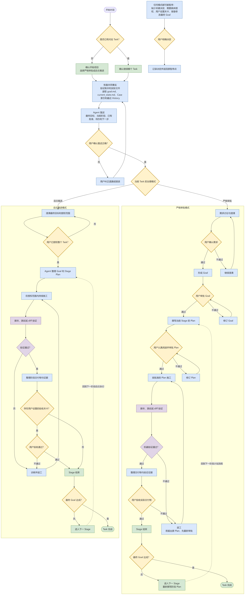

# Portable Agent Project Operating Protocol v5.0.2

[中文](README.md) · [WHY: why use a state machine](docs/WHY_EN.md) · [HOW: how it works](docs/HOW_EN.md) · [Installation](docs/INSTALL.md) · [Migration](docs/MIGRATION.md) · [Windows illustrated guide (Chinese)](https://github.com/canpus/portable-agent-project-operating-protocol/blob/main/docs/guides/PAPOP-v5.0.2-strict-approval-windows-guide-zh.pdf) · [Design notes #001](https://github.com/canpus/portable-agent-project-operating-protocol/blob/main/docs/philosophy/01-Make-AI-Remember-Like-a-Human_EN.md)

PAPOP is a portable set of working rules and a project state machine for Agents.

An **Agent** is an AI that can read files, change content, run commands, and keep working through a task. A **harness** is the application that hosts the Agent, such as Codex, Claude Code, OpenCode, ZCode, or DeepSeek Harness.

An ordinary chat relies heavily on the current conversation. Details can disappear when the conversation becomes long, the harness compacts context automatically, the model changes, or the work resumes days later. PAPOP writes the final goal, plans, user decisions, current state, and historical evidence to project files. The Agent can recover from disk instead of guessing what happened before.

## **WHAT YOU NEED TO DO**

Installation happens once. During everyday work, your responsibilities are:

1. **Describe the final result you want.** One Task is one project. Reuse the existing Task when the same project continues in another conversation.
2. **Choose how much control you want.** Use Strict Approval when you want to review important stages. Use Autonomous when you want to delegate the whole Task. The selected mode is stored in the Task and cannot change silently when rule files are replaced.
3. **In Strict Approval, handle four review points carefully.** Confirm the requirements, approve `goal.md`, read and approve the current Stage's `plan.md`, and inspect the real deliverables before accepting them. State what is correct, what must change, and whether the exact revision is approved.
4. **In Autonomous mode, define the authorization boundary.** The Agent may continue within that boundary. It must still stop for missing key decisions, specific external authorization, irreversible actions, user-defined gates, or a material change to the final Goal.
5. **Manage context before automatic compaction.** If your harness shows context use, consider compacting around the halfway point. Even without a meter, the end of a saved Stage is a good time. First ask the Agent to save a checkpoint and wait for `CHECKPOINT_COMMITTED`; then compact manually. Unsaved details may be lost if automatic compaction happens first.
6. **After compaction, a model change, or a new conversation, check the recovery summary.** The Agent must reread `goal.md` and the current state, then restate the final goal, current Stage, existing approvals, unfinished work, and next action. Correct any mistake before work continues.
7. **Inspect real outputs and machine evidence.** Tests, scripts, and diffs perform verification. The Agent cannot prove completion with a written claim. `AGENT_COMPLETION=COMPLETE` does not mean that you accepted the delivery.
8. **You may provide files at any time, while keeping the originals.** Inputs outside the active Task are copied into its `UserInput/`. Sources outside the workspace are only copied and preserved. Sources inside the workspace but outside the Task may be offered for deletion only after a verified copy and your explicit decision.
9. **Back up the complete Task yourself.** **`.agent-state/` is ignored by Git by default. PAPOP provides no automatic backup, synchronization, or export. A backup or migration must include the whole Task directory and its hidden `.agent-state/` directory.**

The everyday project flow is shown below. The detailed state, ledger, and recovery design is documented in [HOW.md](docs/HOW_EN.md).



## Choose one distribution

PAPOP v5 ships three ZIP files. Install only one state-machine profile in a workspace.

| Distribution | Best for | Behavior |
|---|---|---|
| **GlobalRules Only** | Users who want safer Agent behavior without a state machine | Covers evidence, permissions, Git, `.gitignore`, `.venv`, dependencies, implementation, verification, and external actions |
| **Strict Approval** | Users who want to review every important stage | Requirements confirmation → Goal approval → Stage Plan approval → implementation and verification → Delivery acceptance |
| **Autonomous** | Users who want to delegate a complete Task | Continues within the authorized scope and waits for key decisions, specific authorization, or user gates |

Strict Approval does not ask before every command. The user approves the requirements, final Goal, Stage Plan, and Stage Delivery. Ordinary implementation steps inside the approved Plan continue without another approval.

Autonomous does not mean unsupervised access to everything. Actions outside the authorization boundary still require an explicit decision, and Agent completion remains separate from user acceptance.

## Five-minute installation outline

1. Download one ZIP from the Release and extract it completely. Directories beginning with a dot may be hidden; do not lose `.agent-rules/` or `.agent-protocol/`.
2. Install the contents of `GlobalRules/` in the harness's user-level instruction location.
3. For a state-machine package, place `ProjectRules/AGENTS.md` and `ProjectRules/.agent-protocol/` in the workspace root. Do not keep the outer `ProjectRules/` directory.
4. Back up and merge existing instruction files instead of overwriting them.
5. Start a fresh session. Ask the Agent which instructions it actually loaded, which governance mode is the workspace default, and run the installation check.

Exact paths and checks for Codex, Claude Code, OpenCode, ZCode, and DeepSeek Harness on Windows, Linux, and macOS are in [INSTALL.md](docs/INSTALL.md). PAPOP's end-user scripts need no extra Python, Node, or Mermaid installation. Windows uses the bundled CMD and PowerShell entries; Linux and macOS use the bundled POSIX Shell entries.

Windows readers can also follow the screenshot-based walkthrough: [PAPOP v5.0.2 illustrated installation and usage guide](https://github.com/canpus/portable-agent-project-operating-protocol/blob/main/docs/guides/PAPOP-v5.0.2-strict-approval-windows-guide-zh.pdf). It covers v5.0.2, Windows, and the Strict Approval package only, and is available in Chinese only.

## Workspace layout

```text
<WORKSPACE_ROOT>/
├── AGENTS.md                         # Workspace state-machine entry
├── .agent-protocol/                  # Rules, templates, and portable tools
├── .agent-work/                      # Transactions and locks; ignored by default
├── .agent-cases/                     # User-approved Workspace Cases
└── tasks/
    └── task1_YYYYMMDD_project-name/  # One Task is one Project
        ├── .agent-state/              # Ledger directory; ignored by default
        │   ├── goal.md
        │   ├── plan.md
        │   ├── decisions.md
        │   ├── history.md
        │   ├── current_state.md
        │   ├── snapshots.md
        │   └── cases/
        ├── UserInput/                 # Verified copies of external inputs
        ├── .gitignore
        └── <project files and deliverables>
```

- A **Task** is the complete project and may span many conversations.
- A **Session** is one top-level conversation, a post-compaction recovery, a model change, or a handoff.
- A **Stage** is one plan–implementation–delivery–acceptance cycle.

## The six ledgers

| File | Purpose | Write policy |
|---|---|---|
| `goal.md` | The project's final goal and its revision history | Append-only; a Goal change adds a revision and must be disclosed to the user |
| `plan.md` | Every Stage plan and revision | Append-only |
| `decisions.md` | Explicit user approvals, rejections, authorizations, and changes | Append-only; the Agent cannot invent a user decision |
| `current_state.md` | Where the work is now and what may happen next | The only overwritable core ledger |
| `snapshots.md` | A continuous record of complete Current State checkpoints | Append-only; one Snapshot file per Task |
| `history.md` | The search index linking Plans, Decisions, Cases, Inputs, and exact Snapshot line ranges | Append-only and generated by the checkpoint tool |

Task Cases live under `.agent-state/cases/`. When the same confirmed root cause occurs for the third time in one Task, the Agent must recommend recording a Case. A Case is created only with user approval and may be promoted to Workspace or Global scope only through another explicit user decision.

## Machine-checked state

The checkpoint tool validates the next state and its references before replacing `current_state.md`. It then appends the complete Current State to the single `snapshots.md`, calculates exact line ranges and hashes, appends a searchable `history.md` entry, and reads everything back for verification.

Only `CHECKPOINT_COMMITTED` means the save succeeded. Read-only verification must report `TASK_STATE_VALID`. The Agent may not manually patch these three generated ledgers or substitute its own narrative for machine verification.

## Read next

- [WHY: what problems the state machine solves](docs/WHY_EN.md)
- [HOW: state transitions, user gates, ledgers, recovery, Cases, and file intake](docs/HOW_EN.md)
- [INSTALL: five harnesses and three operating systems](docs/INSTALL.md)
- [MIGRATION: moving an older task to v5](docs/MIGRATION.md)
- [BEHAVIOR_CHECKS: observable checks after installation](docs/BEHAVIOR_CHECKS.md)
- [Illustrated installation and usage guide (PDF, Chinese only, Windows, v5.0.2)](https://github.com/canpus/portable-agent-project-operating-protocol/blob/main/docs/guides/PAPOP-v5.0.2-strict-approval-windows-guide-zh.pdf)
- [Design philosophy #001: Make AI Remember Like a Human](https://github.com/canpus/portable-agent-project-operating-protocol/blob/main/docs/philosophy/01-Make-AI-Remember-Like-a-Human_EN.md) — Chinese original: [让 AI 像人一样记忆](https://github.com/canpus/portable-agent-project-operating-protocol/blob/main/docs/philosophy/01-让AI像人一样记忆.md)
- [CHANGELOG](CHANGELOG.md)

The detailed WHY, HOW, installation, and migration documents are currently maintained in Chinese; this English README contains the complete everyday-user overview.

## Scope and limits

PAPOP reduces context loss, goal drift, skipped approvals, repeated external actions, unsearchable history, and repeated mistakes. It does not replace the harness sandbox or permission system, guarantee that a model never makes an error, or back up your files.

State is a recovery entry point, not unquestionable truth. Every recovery must still compare the ledgers with the latest user instructions, actual files, diffs, tests, and external state.

## License

[MIT License](LICENSE) © 2026 Canpu
